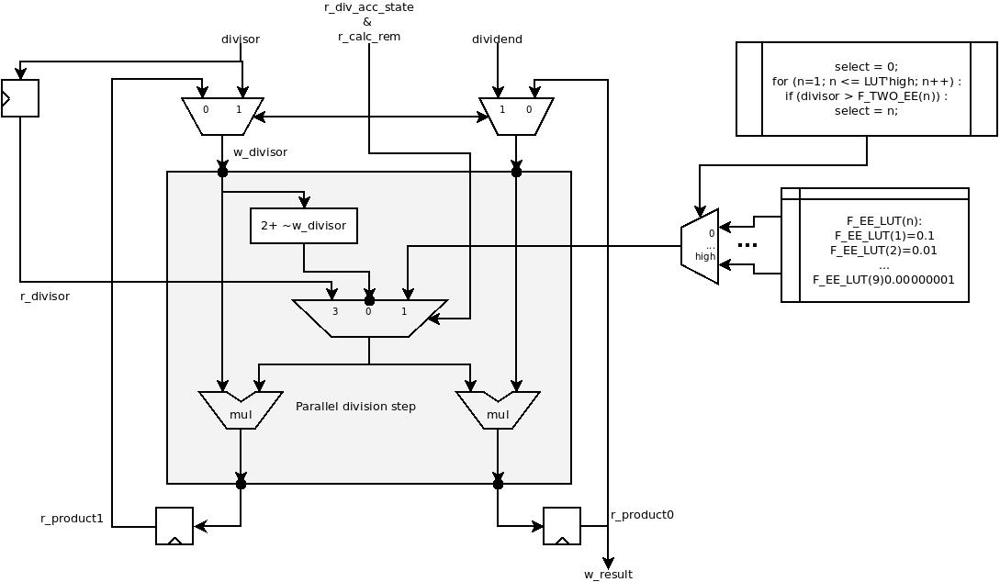
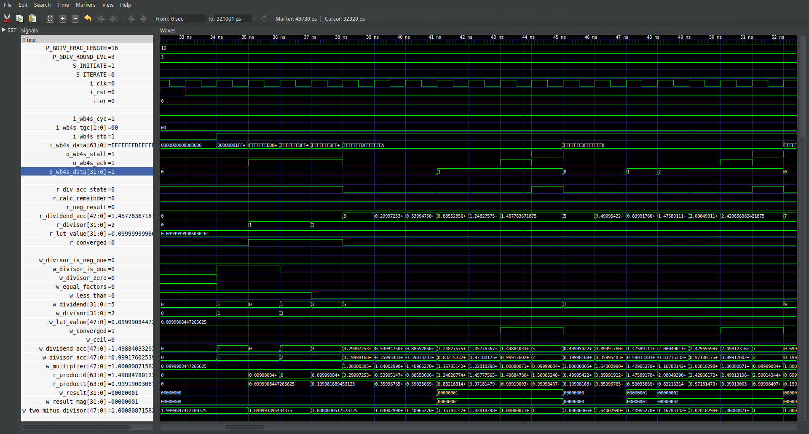

# Goldschmidt Integer Divider (Parallel) Hardware Design Document

## Sumary

The Goldschmidt Integer Divider (parallel) is a fast division algorithm. This module is written in Verilog 2005 (IEEE Standard 1364-2005) using the least-or none-macro functions. This document contains details of the hardeware design & implementation, test bench design and implementation, and example sysnthesis projects.

## Change Log

| Log                                      | Version | Contributor | Date       |
| :--------------------------------------- | :------ | :---------- | :--------- |
| Initial Release                          | v1.0.0  | Jose Garcia | 2021/09/01 |
| Completly revised of code implementation | v2.0.0  | Jose Garcia | 2022/09/11 |

## Table Of Contents

- [Goldschmidt Integer Divider (Parallel) Hardware Design Document](#goldschmidt-integer-divider-parallel-hardware-design-document)
  - [Sumary](#sumary)
  - [Change Log](#change-log)
  - [Table Of Contents](#table-of-contents)
  - [Syntax and Abbreviations](#syntax-and-abbreviations)
  - [Applicable Documents](#applicable-documents)
    - [Table 1](#table-1)
  - [Design](#design)
    - [Division Process](#division-process)
    - [Optimizations](#optimizations)
      - [1's Complement vs 2's Complement](#1s-complement-vs-2s-complement)
      - [Dropping Result MSBs](#dropping-result-msbs)
      - [Function Geneerated Look Up Table](#function-geneerated-look-up-table)
  - [Configurable Parameters](#configurable-parameters)
  - [Clocks and Resets](#clocks-and-resets)
  - [Interfaces](#interfaces)
    - [WisheBone 4 Slave Interface](#wishebone-4-slave-interface)
  - [Memory Map](#memory-map)
  - [Simulation](#simulation)
    - [Simulation Prerequisites](#simulation-prerequisites)
  - [Synthesis](#synthesis)
    - [Synthesis Prerequisites](#synthesis-prerequisites)
  - [Build](#build)
    - [Build Prerequisites](#build-prerequisites)
  - [Directory Structure](#directory-structure)

 ## Syntax and Abbreviations

| Term        | Definition                                    |
| :---------- | :-------------------------------------------- |
| 0b0         | Binary number syntax                          |
| 0x0000_0000 | Hexadecimal number syntax                     |
| bit         | Single binary digit (0 or 1)                  |
| BYTE        | 8-bits wide data unit                         |
| DWORD       | 32-bits wide data unit                        |
| FPGA        | Field Programmable Gate Array                 |
| GDIV        | Goldschmidt Division                          |
| HART        | Hardware thread                               |
| HCC         | High Computational Cost Arithmetics Processor |
| ISA         | Instruction Set Architecture                  |
| LSB         | Least Significant bit                         |
| MSB         | Most Significant bit                          |
| WB          | Wishbone Interface                            |

## Applicable Documents

### Table 1

| Document Title                                                                                 | Revision                 | Filename         |
| :--------------------------------------------------------------------------------------------- | :----------------------- | :--------------- |
| __Wishbone B4__ WISHBONE System-on-Chip (SoC)Interconnection Architecturefor Portable IP Cores | 2010                     | wbspec_b4.pdf    |
| Synthesis of Arithmetic Circuits, FPGA, ASIC and Embedded Systems                              | 1st Edition - March 2006 | non digital book |
| Goldschmidt Integer Divider Hardware Requirements Document                                     | v1.0.0                   | GDIV_HRD.md      |

## Design

The Goldschmidt division is a fast division method. This division is a iterative process governed by the following equations:

$$d(i) = d[i-1].(2-d[i-1])$$
$$D(i) = D[i-1].(2-d[i-1])$$ 

were $d$ is the divisor; $D$ is the dividend; $i$ is the step. $D$ converges toward the quotient and $d$ converges toward 1 at a quadratic rate. For the divisor to converge to 1 it must be less than 2 therefore integers greater than 2 must be multiplied by 10 to the negative powers to shift the decimal point.

Consider the following example: 
$\dfrac{16}{4}$

|  Step  | D                | d                 | 2-d              |
| :----: | :--------------- | :---------------- | :--------------- |
| inputs | 16               | 4                 | \-               |
|   0    | 1.6              | 0.4               | 1.6              |
|   1    | 2.56             | 0.64              | 1.36             |
|   2    | 3.4816           | 0.8704            | 1.1296           |
|   3    | 3.93281536       | 0.98320384        | 1.01679616       |
|   4    | 3.99887155603702 | 0.999717889009254 | 1.00028211099075 |
|   5    | 3.99999968165356 | 0.999999920413389 | 1.00000007958661 |
|   6    | 3.99999999999997 | 0.999999999999994 | 1.00000000000001 |
|   7    | 4                | 1                 | 1                |

The code implementation compares the size of the divisor against 2 ∗ 10^_n_ were _n_ is a natural number. The result of the comparison indicates the _m_ of 10^_m_, were _m_ is a negative integer, to multiply the divisor. Then the Goldschmidt division is performed until the divisor converges to degree indicated by `P GDIV ACCURACY`. The quotient returned is the rounded up value to which the dividend converged to. Each Goldschmidt step is performed in to two half steps in order use only half the multipliers and save resources. 

The remainder calculation requires an extra clock cycle. The calculation simply takes the value after the decimal point of the quotient a multiplies it by the divisor.

### Division Process

The division process starts 

### Optimizations

The following describes design decisions used to optimized the design. These improve resource consumption and timing at the cost of results' precision.

#### 1's Complement vs 2's Complement

In the case of computing $2-d[i-1]$ let us consider the diference between the 2's and 1's complement. The 1's complement of a binary number is the invertion of each bit of the vector that repesents the number. On the other hand the 2's complement operation used to obtain the negative version of a number represented in binary form is the inversion of each bit followed by adding 1. Hence;

$$2 - d[i-1] \equiv 2 + ( invert(d[i-1]) + 1)$$

But as the bit resolution increases the effect less meaningful the contribution of the least significant bit in the magnitud of a binary represented number. Here is a demonstration.

|      Base      |          Binary Form          | Decimal Aproximation |
| :------------: | :---------------------------: | :------------------: |
|      0.3       | 0000.0100_1100_1100_1100_1101 |     0.3000001907     |
| 2's complement | 1111.1011_0011_0011_0011_0011 |    -0.3000001907     |
| 1's complement | 1111.1011_0011_0011_0011_0010 |    -0.3000011444     |

Taking the previous into consideration we can lower the computational complexity by skipping the addition of 1 after the invertion. For our purposes this is an acceptable rounding error, specially when taking into account that the larger the vector the less significant is the error and the more the plus can cost to implement. This is the resulting approximation implemented in the design:

$$2 - d[i-1] \approxeq 2 + invert(d[i-1])$$

#### Dropping Result MSBs

#### Function Geneerated Look Up Table 

## Configurable Parameters

These are the compile time over-writable parameters.

| Parameters            | Default State | Description                                                                                                                                                                                                                                                    |
| :-------------------- | :-----------: | :------------------------------------------------------------------------------------------------------------------------------------------------------------------------------------------------------------------------------------------------------------- |
| `P_GDIV_FACTORS_MSB`  |      31       | Dividend, divisor and results most significant bit.                                                                                                                                                                                                            |
| `P_GDIV_FRAC_LENGTH`  |      16       | Amount of bits used for the vector's portion that represents the fractions digits. (Bits after the fixed point)                                                                                                                                                |
| `P_GDIV_CONV_BITS`    |       8       | Divisor Convergence Threshold. How close to one does it getto accept the result. These are the 32bits after the decimal point, 0.XXXXXXXX expressed as an integer.The default value represent the 999 part of a 64bit binary fractional number equal to 0.999. |
| `P_GDIV_ROUND_UP_LVL` |       3       | Number of bits to look at after the fixed point to decide whether or not to round up the result.                                                                                                                                                               |

## Clocks and Resets

| Signals | Initial State | Direction | Definition                                                                                              |
| :------ | :-----------: | :-------: | :------------------------------------------------------------------------------------------------------ |
| `i_clk` |      N/A      |    In     | Input clock. All interfaces and internal signals are sampled on the positive edge of this clock signal. |
| `i_rst` |      N/A      |    In     | Synchronous reset. Used to reset all registers of this unit.                                            |

## Interfaces

The divider and divisor are received through `i_wb4s_data[P_GDIV_FACTORS_MSB:0]` and `i_wb4s_data[(P_GDIV_FACTORS_MSB*2)+1:P_GDIV_FACTORS_MSB+1]` and qualified by the `i_wb4s_stb`.

When the division concludes the o_master_div_write_stb is asserted and writes the result to the address received through `o_wb4s_data`.

### WisheBone 4 Slave Interface

| Signals        | Reset State | Dimension                      | Direction | Definition                                                                                        |
| :------------- | :---------- | :----------------------------- | :-------- | :------------------------------------------------------------------------------------------------ |
| `i_wb4s_cyc`   | N/A         | 1-bit                          | Input     | Valid data strobe and start indicator.                                                            |
| `i_wb4s_tgc`   | N/A         | [1:0]                          | Input     | Indicates the calculation to perform. bit[1] 0=quotient, 1=remainder; bit[0] 0=signed, 1=unsigned |
| `i_wb4s_stb`   | N/A         | 1-bit                          | Input     | Valid data strobe and start indicator.                                                            |
| `i_wb4s_data`  | N/A         | [(`P_GDIV_FACTORS_MSB`*2)+1:0] | Input     | Divisor and Dividend.                                                                             |
| `o_wb4s_stall` | '1'         | 1-bit                          | Output    | Stall, not ready when set to 1.                                                                   |
| `o_wb4s_ack`   | '1'         | 1-bit                          | Output    | Acknowledge, result valid.                                                                        |
| `o_wb4s_data`  | 0x0         | [`P_GDIV_FACTORS_MSB`:0]       | Ouptu     | Result                                                                                            |

## Memory Map

N/A

## Simulation

### Simulation Prerequisites

Simulation scripts assumes _Icarus Verilog_ (iverilog) as the simulation tool. From the /sim directory run make. Options available are

| Command      | Description                                                           |
| :----------- | :-------------------------------------------------------------------- |
| `make`       | cleans, compiles and runs the test bench, then it loads the waveform. |
| `make clean` | cleans all the compile and simulation products                        |

## Synthesis

### Synthesis Prerequisites

Synthesis scripts assume _Yosys_ as the tool for synthesizing code and _Lattice ICE UP5K_ as the target FPGA device.

| Command              | Description             |
| :------------------- | :---------------------- |
| `yosys syn_ice40.ys` | runs synthesis scripts. |

## Build

### Build Prerequisites

Build scripts are written for the Icestorm tool-chain. The target device is the up5k sold by Lattice.

| Command    | Description                                            |
| :--------- | :----------------------------------------------------- |
| `make all` | cleans, compiles and runs synthesis and build scripts. |

## Directory Structure

- `build` _contains build scripts, synthesis scripts, build constraints, build outputs and bitstreams_
- `sim` _contains simulation scripts and test bench files_
- `source` _contains source code files (*.v)_